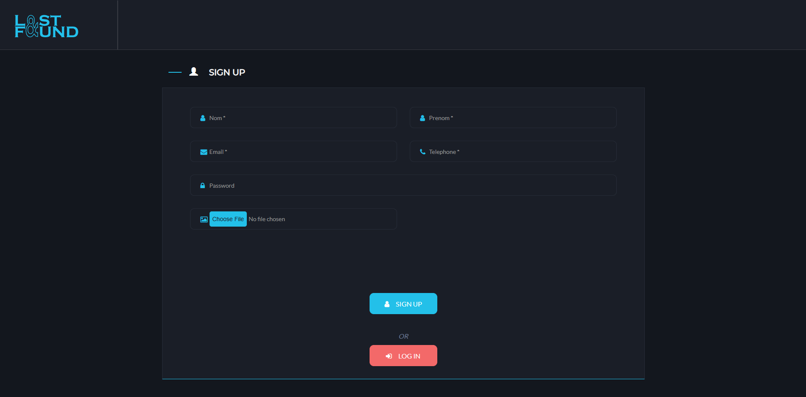
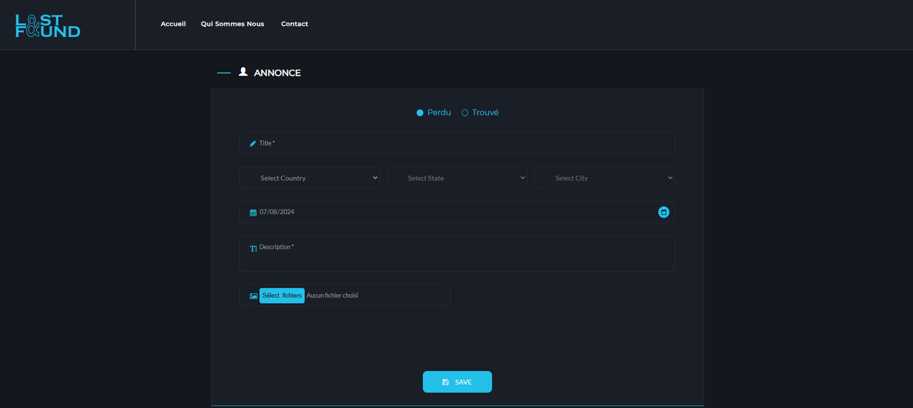
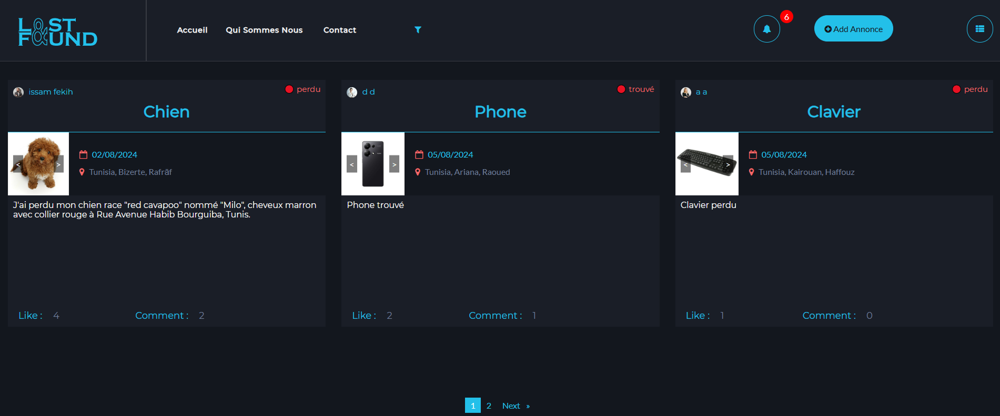
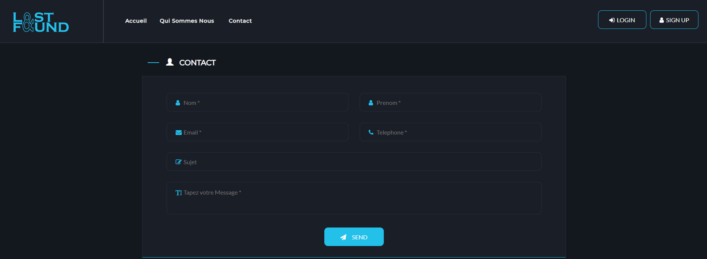
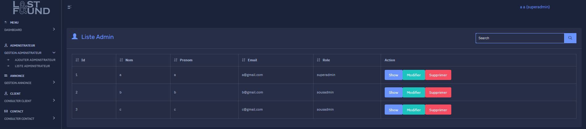
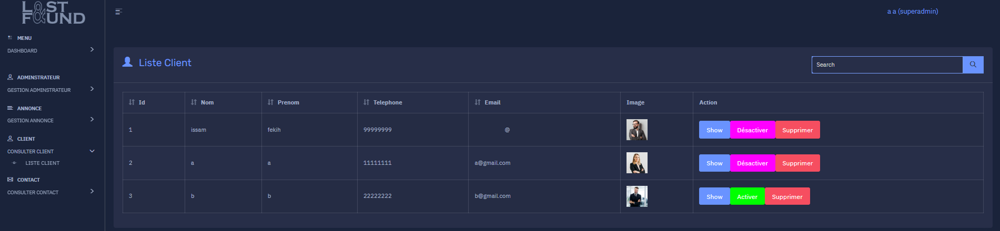
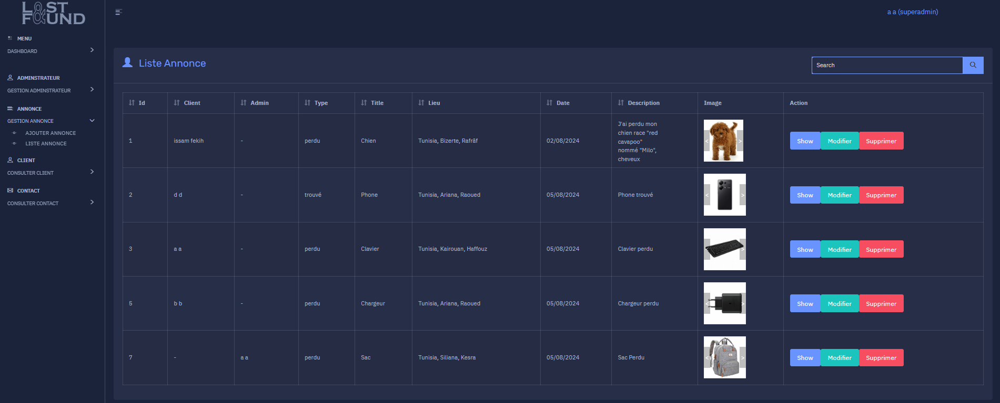
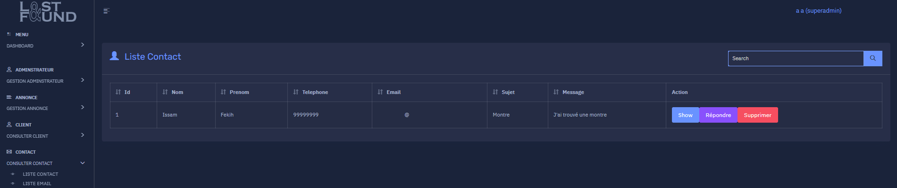
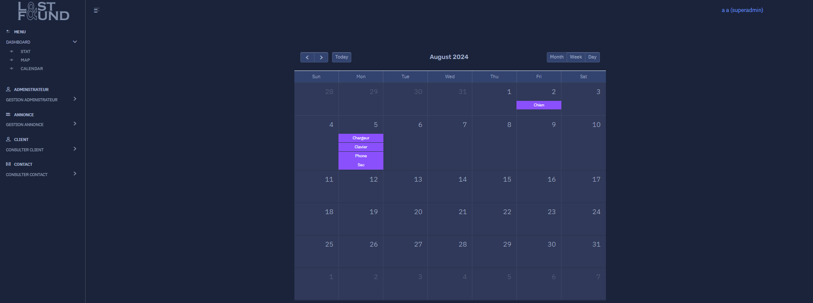

# LOSTANDFOUND
 <br>

- Description <br>
> . <br><br>

### User
1. User SignUp : <br>



2. User can post an announcement about a lost or found object : <br>



3. Announcements posted by users and most liked post appears first : <br>


4. More details on the post with comments : <br>



5. User profile and their posts : <br>


6. Users can contact the website admin : <br>


7. Admin sidebar menu for management : <br>



8. List of admins : <br>



9. List of users : <br>


10. List of announcements : <br>



11. List of contacts : <br>



12. Follow locations of lost and found objects : <br>



13. Announcements sorted by date : <br>



- IDES <br>
 <br>
 <br>

- FRAMEWORKS <br>
 <br>
 <br>

- LANGUAGES <br>
 <br>
 <br>

- ENVIRONMENT <br>
 <br>

- TOOLS <br>
 <br>
 <br>

- DATABASE <br>
 <br>

### How to use
```
npm install -g @angular/cli@16 --force
ng new _
ng g c _
ng g s _
ng s -o
``` 
